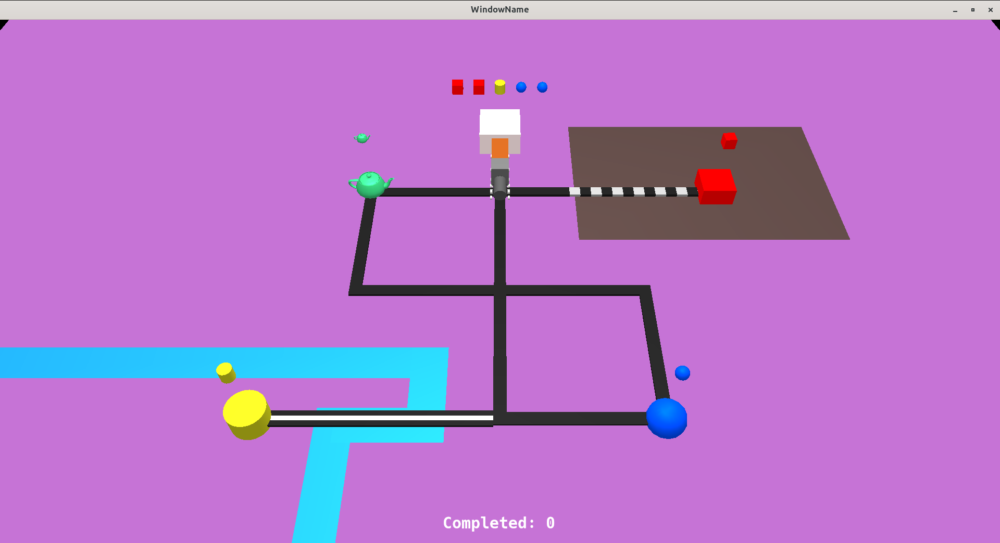
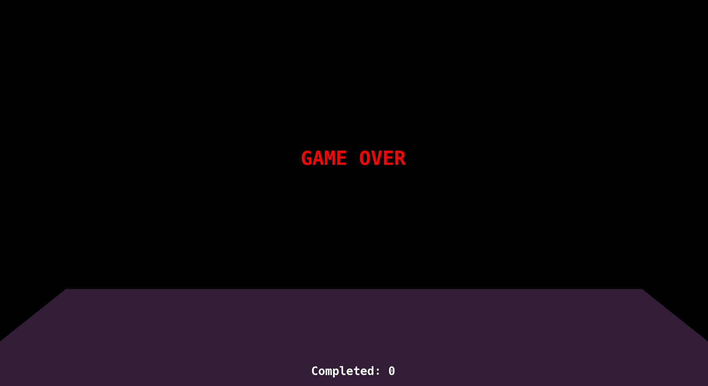

## Description
A 3D mini-game created with C++ and an OpenGL-based API from my University.  
It involved working with meshes, shaders, text renders and camera movement.  
The source code I wrote is found in [this directory](./src/lab_m1/Tema2/). 

## How to Run the Game  
- Check the [API's Readme](API_README.md) for a complete tutorial on setting up the enviroment.  
- After building and running it, a new window should open:  
  

    

## Gameplay Tutorial
- The goal of the game is to collect and deliver items before running out of time.  
Look at the list dislayed above the central station and navigate along the  
track (changing direction with `wasd`) to grab those wanted items from the  
other stations. Bring them back to the station before it turns bright red!  
- If you lose, the game will let you know:  
  
  
    
  
  
- Pressing `R` will restart the game.  

- Have fun!  